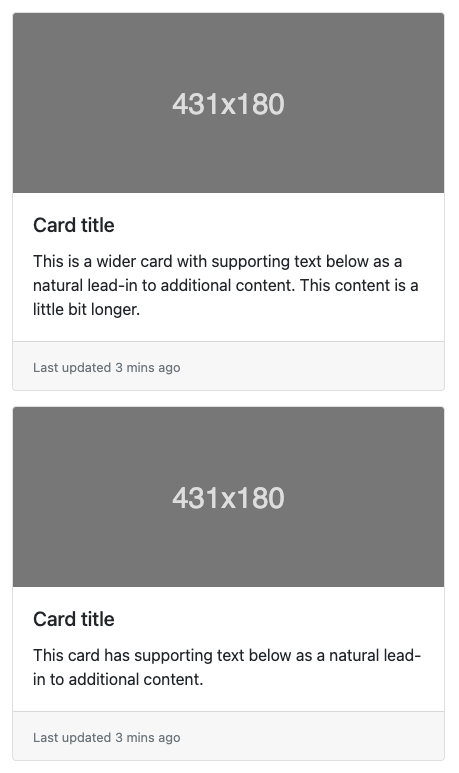
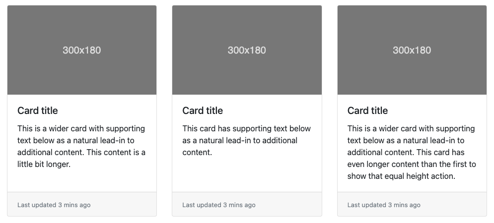

> :white_check_mark: *Jeśli będziesz mieć problem z rozwiązaniem tego zadania, poproś o pomoc na odpowiednim kanale na Slacku, tj. `s8e05-python-frontend-basics` (dotyczy [mentee](https://devmentor.pl/mentoring/)) lub na ogólnodostępnej i bezpłatnej [społeczności na Discordzie](https://devmentor.pl/discord). Pamiętaj, aby treść Twojego wpisu spełniała [odpowiednie kryteria](https://devmentor.pl/jak-prosic-o-pomoc/).*

&nbsp;

# `#06` Python: Podstawowy frontend

Twóim zdaniem jest odtworzenie widoku, który znajdziesz poniżej

Mamy tutaj tzw. [cards](https://getbootstrap.com/docs/4.0/components/card/#card-decks). W naszym przypadku mamy grupę elementów, która składa się z:

- **nagłówka** - obrazek, który jest dostosowany do szerokości elementu (`max-width: 100%`)
- **treści** - nagłówek oraz tekst
- **stopki** - tekst, który jest doczepiony do dolnej krawędzi elementu (użyj `position: relative/absolute` w wersji desktopowej)

Jeśli szerokość dostępnej przestrzeni przekroczy 600px (tzw. breakpoint) to należy zmienić układ elementów na taki, aby całośc wyświetlała sie w jednym wierszu jak na obrazie poniżej (użyj media query).

&nbsp;
> :no_entry: *Jeśli nie posiadasz materiałów do tego zadania tj. **PDF, projekt + Code Review**, znajdziesz je na stronie [devmentor.pl](https://devmentor.pl/workshop-python-frontend-basics)*

> :arrow_left: [*poprzednie zadanie*](./../05) | [*następne zadanie*](./../07) :arrow_right: